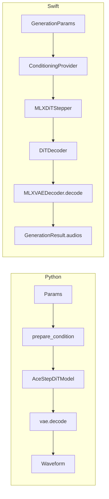

# AceStepSwift Architecture

This document describes the architecture of the original Python ACE-Step generation stack and the Swift package in parallel, how to call the Swift package, and review findings from the Swift code review.

## 1. Overview

The Python codebase (under `acestep/`) provides the reference implementation: audio generation flows from inference entry points through conditioning preparation, a DiT (diffusion transformer) model, and a VAE decoder to produce waveform audio. The Swift package (`AceStepSwift`) reimplements the DiT decoder, VAE decoder, conditioning pipeline, and generation loop on top of MLX so that macOS/iOS apps can run generation locally. The two stacks align on data flow (conditioning → DiT → latents → VAE → waveform), checkpoint layout (with key normalization and Conv weight conversion for DiT), and conditioning contracts (encoder hidden states and context latents). Precomputed conditioning and VAE decoder weights exported from Python can be consumed by the Swift smoke test and by apps that use the same pipeline.

## 2. Python Architecture

### 2.1 Entry flow

- **Public API:** `acestep/inference.py` — `generate_music(dit_handler, llm_handler, params, config, ...)` is the main external entry; it may run an optional LLM phase and then calls `dit_handler.generate_music(...)`.
- **Handler:** `acestep/core/generation/handler/generate_music.py` — `GenerateMusicMixin.generate_music()` coordinates preparation, service generation, decode, and payload.
- **Service generation:** `service_generate.py` → `service_generate_execute.py` — `_execute_service_generate_diffusion()`:
  - Conditioning: `model.prepare_condition(...)` yields `encoder_hidden_states`, `encoder_attention_mask`, `context_latents`.
  - Diffusion: either `_mlx_run_diffusion(...)` (MLX DiT) or `model.generate_audio(...)` (PyTorch).
- **Decode:** `generate_music_decode.py` — `_decode_generate_music_pred_latents()`: predicted latents `[B, T, 64]` are transposed to `[B, 64, T]`, then tiled decode, MLX VAE decode, or `self.vae.decode(...)` → `decoder_output.sample` (waveform).
- **Payload:** `generate_music_payload.py` — `_build_generate_music_success_payload()` builds the final dict with `audios` and optional `extra_outputs` (e.g. encoder hidden states, context latents for Swift).

**Data flow:** Conditioning → DiT (prepare_condition + generate_audio) → target_latents → VAE decode → waveform.

### 2.2 DiT model

- **Definitions:** `acestep/models/base/modeling_acestep_v15_base.py` and turbo variant `acestep/models/turbo/modeling_acestep_v15_turbo.py`.
- **Top-level:** `AceStepConditionGenerationModel.decoder` = `AceStepDiTModel`.
- **Structure:**
  - **proj_in:** `nn.Sequential(Lambda(transpose), nn.Conv1d(in_channels, inner_dim, kernel_size=patch_size, stride=patch_size), Lambda(transpose))` — input `[B, T, C]` → conv → `[B, T//patch_size, inner_dim]`.
  - **proj_out:** `nn.Sequential(Lambda(transpose), nn.ConvTranspose1d(inner_dim, audio_acoustic_hidden_dim, ...), Lambda(transpose))` — back to `[B, T, audio_acoustic_hidden_dim]`.
  - **Layers:** `AceStepDiTLayer` with self-attn (AdaLN), optional cross-attn, MLP; `layer_types` alternate sliding vs full attention.
  - **Scale-shift:** Decoder uses `scale_shift_table` shape `[1, 2, inner_dim]`; layers use `[1, 6, hidden_size]` for AdaLN modulation.
- **Config (base/turbo):** `hidden_size` = 2048, `num_hidden_layers` = 24, `in_channels` = 192, `patch_size` = 2, `audio_acoustic_hidden_dim` = 64, `text_hidden_dim` = 1024, `intermediate_size` = 6144, `num_attention_heads` = 16, `num_key_value_heads` = 8, `head_dim` = 128, `sliding_window` = 128.

### 2.3 VAE

- **Source:** Diffusers `AutoencoderOobleck`, loaded from `checkpoints/vae` via `AutoencoderOobleck.from_pretrained(vae_checkpoint_path)`.
- **Decode:** Input latents `[B, 64, T]` (transposed from `[B, T, 64]`) → `vae.decode(...)` → `.sample` (waveform). Tiled and MLX paths exist for long sequences.

### 2.4 Conditioning

- **Build:** Text/lyrics/reference audio → text encoder + lyric embeddings + timbre encoder → encoder hidden states; source/chunk data → src_latents, chunk_masks → context_latents. `model.prepare_condition(...)` returns `encoder_hidden_states` [B, encL, 2048], `encoder_attention_mask`, and `context_latents` [B, T, 128].

### 2.5 Swift-oriented exports

- **Conditioning:** `scripts/export_conditioning_for_swift.py` runs generation with fixed params and writes from `extra_outputs`:
  - `encoder_hidden_states.bin` — shape (3× int32) then float32 row-major.
  - `context_latents.bin` — same format.
  - `initial_noise.bin` — same format, shape (1, T, 64), fixed seed when MLX available.
- **VAE decoder:** `scripts/export_vae_decoder_mlx.py` loads PyTorch VAE from `--vae-dir` (default `checkpoints/vae`), runs `vae_convert.convert_vae_weights(vae)`, keeps keys with prefix `decoder.`, saves float32 to a single safetensors file (e.g. `checkpoints/vae/decoder.safetensors`) for Swift `MLXVAEDecoder.loadWeights(from:)`.

---

## 3. Swift Architecture

### 3.1 Package layout

- **Product:** Single library `AceStepSwift` (see [Package.swift](../Package.swift)).
- **Dependencies:** MLX, MLXNN, MLXRandom (mlx-swift); MLXLMCommon, MLXLLM (mlx-swift-lm).
- **Sources:** Flat list under `Sources/AceStepSwift/`.

### 3.2 Key modules

| Area | Files |
|------|--------|
| Engine / pipeline | [AceStepEngine.swift](../Sources/AceStepSwift/AceStepEngine.swift), [ContractGenerationPipeline.swift](../Sources/AceStepSwift/ContractGenerationPipeline.swift), [GenerationPipeline.swift](../Sources/AceStepSwift/GenerationPipeline.swift) |
| DiT | [DiTDecoder.swift](../Sources/AceStepSwift/DiTDecoder.swift), [DiTLayer.swift](../Sources/AceStepSwift/DiTLayer.swift), [DiTAttention.swift](../Sources/AceStepSwift/DiTAttention.swift), [DiTSwiGLUMLP.swift](../Sources/AceStepSwift/DiTSwiGLUMLP.swift), [DiTTimestepEmbedding.swift](../Sources/AceStepSwift/DiTTimestepEmbedding.swift), [DiTRotaryEmbedding.swift](../Sources/AceStepSwift/DiTRotaryEmbedding.swift), [DiTDiffusionContract.swift](../Sources/AceStepSwift/DiTDiffusionContract.swift), [DiTCrossAttentionCache.swift](../Sources/AceStepSwift/DiTCrossAttentionCache.swift) |
| Stepper | [MLXDiTStepper.swift](../Sources/AceStepSwift/MLXDiTStepper.swift) |
| VAE | [MLXVAEDecoder.swift](../Sources/AceStepSwift/MLXVAEDecoder.swift), [MLXAutoEncoderOobleck.swift](../Sources/AceStepSwift/MLXAutoEncoderOobleck.swift), [VAEResidualUnit.swift](../Sources/AceStepSwift/VAEResidualUnit.swift), [VAEDecoderBlock.swift](../Sources/AceStepSwift/VAEDecoderBlock.swift), etc. |
| Conditioning | [PrepareCondition.swift](../Sources/AceStepSwift/PrepareCondition.swift), [ConditionEncoder.swift](../Sources/AceStepSwift/ConditionEncoder.swift), [QwenTextHiddenStateProvider.swift](../Sources/AceStepSwift/QwenTextHiddenStateProvider.swift) |
| Weight loading | [WeightLoading.swift](../Sources/AceStepSwift/WeightLoading.swift) |
| Params / result | [GenerationParams.swift](../Sources/AceStepSwift/GenerationParams.swift), [GenerationConfig.swift](../Sources/AceStepSwift/GenerationConfig.swift), [GenerationResult.swift](../Sources/AceStepSwift/GenerationResult.swift), [DiffusionSchedule.swift](../Sources/AceStepSwift/DiffusionSchedule.swift) |

### 3.3 Generation data flow

1. **Entry:** `AceStepEngine.generateMusic(params:config:progress:pipeline:)` with a `GenerationPipeline` (typically `ContractGenerationPipeline`).
2. **Pipeline run:** `ContractGenerationPipeline.run(params:config:progress:)`:
   - Computes **latent length** `T = latentLengthFromDuration(params.duration, sampleRate)` (minimum 128).
   - Gets **timestep schedule** via `DiffusionSchedule.getTimestepSchedule(shift:timesteps:inferSteps:)`.
   - Gets **conditions:** `conditioningProvider?(params, T, sampleRate)` → `DiTConditions`. If nil and stepper is `MLXDiTStepper`, throws; otherwise may run with zeros (output not meaningful).
   - Aligns conditions to batch (broadcast batch 1 → B if needed).
   - **Initial latent:** `conditions.initialLatents` if shape `[B, T, 64]`, else noise `MLXRandom.normal([B, T, 64])` (optional seed from `params.seed`).
   - **Loop:** For each timestep in schedule, `runDiffusionStep` (uses `DiffusionStepper.step` or, for CFG, `predictVelocity` + APG then step).
   - **Post-process:** Optional latent shift/rescale, then `decoder.decode(latent:)` (VAE).
   - **Audio:** Normalize peak if needed, `buildAudiosFromDecoded` → list of `["tensor": [Float], "sample_rate": Int, "channels": Int]`.
   - Returns `GenerationResult` with `audios`, `success`, `error`, `statusMessage`.

3. **Stepper:** `MLXDiTStepper.step` / `predictVelocity` fills missing conditions with zeros, calls `DiTDecoder.call(hiddenStates:timestep:timestepR:encoderHiddenStates:contextLatents:cache:useCache:)` → velocity; ODE step: `currentLatent - vt * dt` (or `* timestep` on last step).

4. **DiT decoder:** `DiTDecoder.call` — time embedding, concat context + hidden on channel axis, patch in (`projIn`), condition embedder on encoder hidden states; transformer layers (self-attn, cross-attn, MLP with AdaLN); output norm (scale/shift), `projOut`, crop to `originalSeqLen` → velocity `[B, T, 64]`.

5. **VAE:** `MLXVAEDecoder.decode(latent:)` → `MLXAutoEncoderOobleck.decode(latentsNLC:)` → waveform `[B, L_audio, C_audio]`.

### 3.4 Weight loading

- **File:** [WeightLoading.swift](../Sources/AceStepSwift/WeightLoading.swift).
- **loadDiTParameters(from: url):** Loads flat arrays from URL (via `loadArrays(url:)`), normalizes PyTorch Sequential keys (`proj_in.1.*` → `proj_in.*`, `proj_out.1.*` → `proj_out.*`), maps snake_case to camelCase (`diTParameterKeyToSwift`), and converts Conv/ConvTranspose1d weights from PyTorch layout to MLX (Conv1d `[out,in,K]` → `[out,K,in]`; ConvTranspose1d `[in,out,K]` → `[out,K,in]`). Returns `ModuleParameters.unflattened(remapped)` for `decoder.update(parameters:)`.
- **loadDiTParametersForDecoder(from: url):** Calls `loadDiTParameters`, flattens, keeps keys with prefix `"decoder."`, strips that prefix, unflattens. Used when the checkpoint is the full model (e.g. HuggingFace-style with `decoder.*`). If no key has that prefix, returns the full parameters (decoder-only checkpoint).
- **loadParameters(from: url):** Generic loader; no key or weight conversion.
- **Dependency:** `loadDiTParameters(from:)` and `loadParameters(from:)` call **MLX**’s `loadArrays(url:stream:)` (from the mlx-swift package), which reads safetensors and returns `[String: MLXArray]`. The AceStepSwift target depends on MLX, so no extra implementation is required. See [Section 6](#6-review-findings-and-possible-bugs) for historical note.

### 3.5 Conditioning contract

- **DiTConditions:** `encoderHiddenStates` [B, encL, 2048], `contextLatents` [B, T, 128], optional `nullConditionEmbedding`, optional `initialLatents`.
- **ConditioningProvider:** Closure type `(GenerationParams, Int, Int) -> DiTConditions?` — receives `(params, latentLength, sampleRate)` and should return conditions with shapes matching the diffusion loop (T = latentLength).
- **Building conditions:** Use `prepareCondition(inputs:conditionEncoder:)` with [PrepareCondition](../Sources/AceStepSwift/PrepareCondition.swift) and optionally [ConditionEncoder](../Sources/AceStepSwift/ConditionEncoder.swift) plus [QwenTextHiddenStateProvider](../Sources/AceStepSwift/QwenTextHiddenStateProvider.swift), or load precomputed `encoder_hidden_states.bin` / `context_latents.bin` as in the smoke test.

---

## 4. Parallel View

### 4.1 Data flow diagram



### 4.2 Component mapping

| Python | Swift |
|--------|--------|
| `acestep/inference.generate_music` | `AceStepEngine.generateMusic` |
| Handler `generate_music` → service_generate → diffusion | `ContractGenerationPipeline.run` → diffusion loop |
| `model.prepare_condition(...)` | `ConditioningProvider` + `prepareCondition(inputs:conditionEncoder:)` |
| `encoder_hidden_states`, `context_latents` | `DiTConditions.encoderHiddenStates`, `contextLatents` |
| `AceStepDiTModel` (decoder) | `DiTDecoder` |
| DiT forward in generation loop | `MLXDiTStepper.step` / `predictVelocity` → `DiTDecoder.call` |
| `vae.decode(pred_latents)` | `MLXVAEDecoder.decode(latent:)` |
| `AutoencoderOobleck` (decoder) | `MLXAutoEncoderOobleck` / `MLXVAEDecoder` |
| `export_conditioning_for_swift.py` outputs | Precomputed bins loaded in smoke test / app (`loadPrecomputedConditioning`) |
| `export_vae_decoder_mlx.py` → `decoder.safetensors` | `MLXVAEDecoder.loadWeights(from:)` |
| Full checkpoint `decoder.*` keys | `loadDiTParametersForDecoder` strips `decoder.` prefix |

---

## 5. How to Call the Swift Package

### 5.1 Entry point

```swift
let result = AceStepEngine.generateMusic(
    params: params,
    config: config,
    progress: { progress, message in /* optional */ },
    pipeline: pipeline
)
```

Use a `GenerationPipeline` (typically `ContractGenerationPipeline`). The pipeline must be fully initialized (stepper with loaded DiT, decoder with loaded VAE, and a conditioning provider for meaningful output).

### 5.2 Pipeline setup

**ContractGenerationPipeline:**

```swift
let pipeline = ContractGenerationPipeline(
    stepper: stepper,
    decoder: vaeDecoder,
    sampleRate: 48000,
    conditioningProvider: conditioningProvider
)
```

- **Stepper:** Build a `DiTDecoder()` with the same config as the checkpoint (defaults match turbo), load weights, then wrap in `MLXDiTStepper`:

  ```swift
  let ditDecoder = DiTDecoder()
  let ditParams = try loadDiTParametersForDecoder(from: ditWeightsURL)
  ditDecoder.update(parameters: ditParams)
  let stepper = MLXDiTStepper(decoder: ditDecoder)
  ```

  Weights URL: e.g. directory containing `model.safetensors` → `URL(...).appendingPathComponent("model.safetensors")`.

- **Decoder (VAE):** Create `MLXVAEDecoder`, then load decoder weights from the safetensors produced by `export_vae_decoder_mlx.py`:

  ```swift
  let vaeDecoder = MLXVAEDecoder()
  try vaeDecoder.loadWeights(from: vaeDecoderSafetensorsURL)
  ```

- **Conditioning:** Implement `ConditioningProvider` so that it returns `DiTConditions` with:
  - `encoderHiddenStates`: shape `[B, encL, 2048]`
  - `contextLatents`: shape `[B, latentLength, 128]`
  - (optional) `encoderAttentionMask`: shape `[B, encL]` for cross-attention padding when encoder sequences are variable-length.

  Either:
  - Call `prepareCondition(inputs:conditionEncoder:)` with text/lyric/source inputs and a `ConditionEncoder` (and e.g. `QwenTextHiddenStateProvider`), or
  - Load precomputed `encoder_hidden_states.bin` and `context_latents.bin` from a directory (see [GenerationSmokeTests](../Tests/AceStepSwiftTests/GenerationSmokeTests.swift) for binary format and slicing when T differs).

### 5.3 Params and config

- **GenerationParams:** `duration`, `inferenceSteps`, `seed`, `shift`, `taskType`, caption, lyrics, etc.
- **GenerationConfig:** `batchSize`, seed policy, audio format, etc.

### 5.4 Result

- **GenerationResult:** `audios` (array of dictionaries: `"tensor"` [Float], `"sample_rate"` Int, `"channels"` Int), `success`, `error`, `statusMessage`, `extraOutputs`.

### 5.5 Smoke test environment variables

When running the Swift smoke test (e.g. to compare with Python output):

| Variable | Purpose |
|----------|---------|
| `DIT_WEIGHTS_PATH` | Directory containing `model.safetensors` (DiT decoder weights). |
| `VAE_WEIGHTS_PATH` | Path to VAE decoder safetensors file (e.g. `checkpoints/vae/decoder.safetensors`). |
| `CONDITIONING_DIR` | Directory with `encoder_hidden_states.bin`, `context_latents.bin` (and optionally `initial_noise.bin`). |
| `OUTPUT_DIR` | If set, test writes `swift_out.wav` for validation. |

See [scripts/README.md](../../scripts/README.md) and [GenerationSmokeTests](../Tests/AceStepSwiftTests/GenerationSmokeTests.swift) for details.

---

## 6. Review Findings and Possible Bugs

Findings from reviewing the Swift code for parity with Python and for library robustness.

| Finding | Location | Severity | Notes |
|--------|----------|----------|--------|
| **Hardcoded debug log path** | [ContractGenerationPipeline.swift](../Sources/AceStepSwift/ContractGenerationPipeline.swift) | Resolved | File logging to a fixed path was removed; the library no longer writes debug logs to disk. Use `debugPrint` in DEBUG builds only. |
| **`loadArrays` dependency** | [WeightLoading.swift](../Sources/AceStepSwift/WeightLoading.swift) (lines 53, 84) | Resolved | `loadDiTParameters` and `loadParameters` use **MLX**’s `loadArrays(url:stream:)` (mlx-swift package) to read safetensors. The AceStepSwift target already depends on MLX; no in-repo implementation is required. |
| **timestep_r semantics** | [SWIFT_VS_PYTHON_LOGIC.md](SWIFT_VS_PYTHON_LOGIC.md) §8 | Resolved | Previously `MLXDiTStepper` passed 0 for `timestep_r`, so the second time embedding saw the full timestep instead of 0. This is fixed: the stepper now passes the current timestep for both `timestep` and `timestep_r`, so the decoder sees `timestep - timestep_r = 0` for the second embedding, matching Python. |
| **Encoder attention mask** | [DiTDiffusionContract.swift](../Sources/AceStepSwift/DiTDiffusionContract.swift), DiTDecoder, DiTLayer | Resolved | `DiTConditions` now includes optional `encoderAttentionMask` [B, encL]; it is threaded through the pipeline, CFG path, stepper, and decoder into cross-attention so Swift matches Python when encoder sequences are padded. |
| **Zero conditioning** | [ContractGenerationPipeline.swift](../Sources/AceStepSwift/ContractGenerationPipeline.swift) | Documented | When no `ConditioningProvider` is supplied or it returns empty conditions, the pipeline uses zeros for encoder and context. With `MLXDiTStepper` it throws; with a fake stepper it runs but output is not meaningful. Real generation requires a provider that returns encoder hidden states [B, encL, 2048], context latents [B, T, 128], and optionally `encoderAttentionMask` [B, encL]. See [SWIFT_VS_PYTHON_LOGIC.md](SWIFT_VS_PYTHON_LOGIC.md) §13. |
| **Snake1d dtype** | [VAESnake1d](../Sources/AceStepSwift/VAESnake1d.swift) | Minor | Swift does not special-case float32 upcast for exp/sin when weights are float16; Python may. Effect is minor for typical float32 VAE. |

For a detailed logic-by-logic comparison of Swift and Python (DiT, VAE, schedule, conditioning), see [SWIFT_VS_PYTHON_LOGIC.md](SWIFT_VS_PYTHON_LOGIC.md). For DiT port status and weight-loading notes, see [DIT_PORT_STATUS.md](DIT_PORT_STATUS.md).
