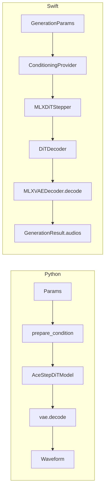
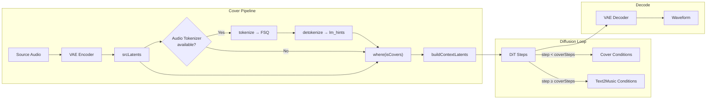

# AceStepSwift Architecture

This document describes the architecture of the original Python ACE-Step generation stack and the Swift package in parallel, how to call the Swift package, and review findings from the Swift code review.

## 1. Overview

The Python codebase (under `acestep/`) provides the reference implementation: audio generation flows from inference entry points through conditioning preparation, a DiT (diffusion transformer) model, and a VAE decoder to produce waveform audio. The Swift package (`AceStepSwift`) reimplements the DiT decoder, VAE decoder, conditioning pipeline, and generation loop on top of MLX so that macOS/iOS apps can run generation locally. The two stacks align on data flow (conditioning → DiT → latents → VAE → waveform), checkpoint layout (with key normalization and Conv weight conversion for DiT), and conditioning contracts (encoder hidden states and context latents). Precomputed conditioning and VAE decoder weights exported from Python can be consumed by the Swift smoke test and by apps that use the same pipeline.

## 2. Python Architecture

### 2.1 Entry flow

- **Public API:** `acestep/inference.py` — `generate_music(dit_handler, llm_handler, params, config, ...)` is the main external entry; it may run an optional LLM phase and then calls `dit_handler.generate_music(...)`.
- **Handler:** `acestep/core/generation/handler/generate_music.py` — `GenerateMusicMixin.generate_music()` coordinates preparation, service generation, decode, and payload.
- **Service generation:** `service_generate.py` → `service_generate_execute.py` — `_execute_service_generate_diffusion()`:
  - Conditioning: `model.prepare_condition(...)` yields `encoder_hidden_states`, `encoder_attention_mask`, `context_latents`.
  - Diffusion: either `_mlx_run_diffusion(...)` (MLX DiT) or `model.generate_audio(...)` (PyTorch).
- **Decode:** `generate_music_decode.py` — `_decode_generate_music_pred_latents()`: predicted latents `[B, T, 64]` are transposed to `[B, 64, T]`, then tiled decode, MLX VAE decode, or `self.vae.decode(...)` → `decoder_output.sample` (waveform).
- **Payload:** `generate_music_payload.py` — `_build_generate_music_success_payload()` builds the final dict with `audios` and optional `extra_outputs` (e.g. encoder hidden states, context latents for Swift).

**Data flow:** Conditioning → DiT (prepare_condition + generate_audio) → target_latents → VAE decode → waveform.

### 2.2 DiT model

- **Definitions:** `acestep/models/base/modeling_acestep_v15_base.py` and turbo variant `acestep/models/turbo/modeling_acestep_v15_turbo.py`.
- **Top-level:** `AceStepConditionGenerationModel.decoder` = `AceStepDiTModel`.
- **Structure:**
  - **proj_in:** `nn.Sequential(Lambda(transpose), nn.Conv1d(in_channels, inner_dim, kernel_size=patch_size, stride=patch_size), Lambda(transpose))` — input `[B, T, C]` → conv → `[B, T//patch_size, inner_dim]`.
  - **proj_out:** `nn.Sequential(Lambda(transpose), nn.ConvTranspose1d(inner_dim, audio_acoustic_hidden_dim, ...), Lambda(transpose))` — back to `[B, T, audio_acoustic_hidden_dim]`.
  - **Layers:** `AceStepDiTLayer` with self-attn (AdaLN), optional cross-attn, MLP; `layer_types` alternate sliding vs full attention.
  - **Scale-shift:** Decoder uses `scale_shift_table` shape `[1, 2, inner_dim]`; layers use `[1, 6, hidden_size]` for AdaLN modulation.
- **Config (base/turbo):** `hidden_size` = 2048, `num_hidden_layers` = 24, `in_channels` = 192, `patch_size` = 2, `audio_acoustic_hidden_dim` = 64, `text_hidden_dim` = 1024, `intermediate_size` = 6144, `num_attention_heads` = 16, `num_key_value_heads` = 8, `head_dim` = 128, `sliding_window` = 128.

### 2.3 VAE

- **Source:** Diffusers `AutoencoderOobleck`, loaded from `checkpoints/vae` via `AutoencoderOobleck.from_pretrained(vae_checkpoint_path)`.
- **Decode:** Input latents `[B, 64, T]` (transposed from `[B, T, 64]`) → `vae.decode(...)` → `.sample` (waveform). Tiled and MLX paths exist for long sequences.

### 2.4 Conditioning

- **Build:** Text/lyrics/reference audio → text encoder + lyric embeddings + timbre encoder → encoder hidden states; source/chunk data → src_latents, chunk_masks → context_latents. `model.prepare_condition(...)` returns `encoder_hidden_states` [B, encL, 2048], `encoder_attention_mask`, and `context_latents` [B, T, 128].

### 2.5 Swift-oriented exports

- **Conditioning:** `scripts/export_conditioning_for_swift.py` runs generation with fixed params and writes from `extra_outputs`:
  - `encoder_hidden_states.bin` — shape (3× int32) then float32 row-major.
  - `context_latents.bin` — same format.
  - `initial_noise.bin` — same format, shape (1, T, 64), fixed seed when MLX available.
- **VAE decoder:** `scripts/export_vae_decoder_mlx.py` loads PyTorch VAE from `--vae-dir` (default `checkpoints/vae`), runs `vae_convert.convert_vae_weights(vae)`, keeps keys with prefix `decoder.`, saves float32 to a single safetensors file (e.g. `checkpoints/vae/decoder.safetensors`) for Swift `MLXVAEDecoder.loadWeights(from:)`.

---

## 3. Swift Architecture

### 3.1 Package layout

- **Product:** Single library `AceStepSwift` (see [Package.swift](../Package.swift)).
- **Dependencies:** MLX, MLXNN, MLXRandom (mlx-swift); MLXLMCommon, MLXLLM (mlx-swift-lm).
- **Sources:** Flat list under `Sources/AceStepSwift/`.

### 3.2 Key modules

| Area | Files |
|------|--------|
| Engine / pipeline | [AceStepEngine.swift](../Sources/AceStepSwift/AceStepEngine.swift), [ContractGenerationPipeline.swift](../Sources/AceStepSwift/ContractGenerationPipeline.swift), [GenerationPipeline.swift](../Sources/AceStepSwift/GenerationPipeline.swift) |
| DiT | [DiTDecoder.swift](../Sources/AceStepSwift/DiTDecoder.swift), [DiTLayer.swift](../Sources/AceStepSwift/DiTLayer.swift), [DiTAttention.swift](../Sources/AceStepSwift/DiTAttention.swift), [DiTSwiGLUMLP.swift](../Sources/AceStepSwift/DiTSwiGLUMLP.swift), [DiTTimestepEmbedding.swift](../Sources/AceStepSwift/DiTTimestepEmbedding.swift), [DiTRotaryEmbedding.swift](../Sources/AceStepSwift/DiTRotaryEmbedding.swift), [DiTDiffusionContract.swift](../Sources/AceStepSwift/DiTDiffusionContract.swift), [DiTCrossAttentionCache.swift](../Sources/AceStepSwift/DiTCrossAttentionCache.swift) |
| Stepper | [MLXDiTStepper.swift](../Sources/AceStepSwift/MLXDiTStepper.swift) |
| VAE | [MLXVAEDecoder.swift](../Sources/AceStepSwift/MLXVAEDecoder.swift), [MLXAutoEncoderOobleck.swift](../Sources/AceStepSwift/MLXAutoEncoderOobleck.swift), [VAEResidualUnit.swift](../Sources/AceStepSwift/VAEResidualUnit.swift), [VAEDecoderBlock.swift](../Sources/AceStepSwift/VAEDecoderBlock.swift), etc. |
| Conditioning | [PrepareCondition.swift](../Sources/AceStepSwift/PrepareCondition.swift), [ConditionEncoder.swift](../Sources/AceStepSwift/ConditionEncoder.swift), [QwenTextHiddenStateProvider.swift](../Sources/AceStepSwift/QwenTextHiddenStateProvider.swift) |
| Audio Tokenizer | [MLXAudioTokenizer.swift](../Sources/AceStepSwift/MLXAudioTokenizer.swift), [MLXAudioDetokenizer.swift](../Sources/AceStepSwift/MLXAudioDetokenizer.swift) |
| Weight loading | [WeightLoading.swift](../Sources/AceStepSwift/WeightLoading.swift) |
| Params / result | [GenerationParams.swift](../Sources/AceStepSwift/GenerationParams.swift), [GenerationConfig.swift](../Sources/AceStepSwift/GenerationConfig.swift), [GenerationResult.swift](../Sources/AceStepSwift/GenerationResult.swift), [DiffusionSchedule.swift](../Sources/AceStepSwift/DiffusionSchedule.swift) |

### 3.3 Generation data flow

1. **Entry:** `AceStepEngine.generateMusic(params:config:progress:pipeline:)` with a `GenerationPipeline` (typically `ContractGenerationPipeline`).
2. **Pipeline run:** `ContractGenerationPipeline.run(params:config:progress:)`:
   - Computes **latent length** `T = latentLengthFromDuration(params.duration, sampleRate)` (minimum 128).
   - Gets **timestep schedule** via `DiffusionSchedule.getTimestepSchedule(shift:timesteps:inferSteps:)`.
   - Gets **conditions:** `conditioningProvider?(params, T, sampleRate)` → `DiTConditions`. If nil and stepper is `MLXDiTStepper`, throws; otherwise may run with zeros (output not meaningful).
   - Aligns conditions to batch (broadcast batch 1 → B if needed).
   - **Initial latent:** `conditions.initialLatents` if shape `[B, T, 64]`, else noise `MLXRandom.normal([B, T, 64])` (optional seed from `params.seed`).
   - **Loop:** For each timestep in schedule, `runDiffusionStep` (uses `DiffusionStepper.step` or, for CFG, `predictVelocity` + APG then step).
   - **Post-process:** Optional latent shift/rescale, then `decoder.decode(latent:)` (VAE).
   - **Audio:** Normalize peak if needed, `buildAudiosFromDecoded` → list of `["tensor": [Float], "sample_rate": Int, "channels": Int]`.
   - Returns `GenerationResult` with `audios`, `success`, `error`, `statusMessage`.

3. **Stepper:** `MLXDiTStepper.step` / `predictVelocity` fills missing conditions with zeros, calls `DiTDecoder.call(hiddenStates:timestep:timestepR:encoderHiddenStates:contextLatents:cache:useCache:)` → velocity; ODE step: `currentLatent - vt * dt` (or `* timestep` on last step).

4. **DiT decoder:** `DiTDecoder.call` — time embedding, concat context + hidden on channel axis, patch in (`projIn`), condition embedder on encoder hidden states; transformer layers (self-attn, cross-attn, MLP with AdaLN); output norm (scale/shift), `projOut`, crop to `originalSeqLen` → velocity `[B, T, 64]`.

5. **VAE:** `MLXVAEDecoder.decode(latent:)` → `MLXAutoEncoderOobleck.decode(latentsNLC:)` → waveform `[B, L_audio, C_audio]`.

### 3.4 Weight loading

- **File:** [WeightLoading.swift](../Sources/AceStepSwift/WeightLoading.swift).
- **loadDiTParameters(from: url):** Loads flat arrays from URL (via `loadArrays(url:)`), normalizes PyTorch Sequential keys (`proj_in.1.*` → `proj_in.*`, `proj_out.1.*` → `proj_out.*`), maps snake_case to camelCase (`diTParameterKeyToSwift`), and converts Conv/ConvTranspose1d weights from PyTorch layout to MLX (Conv1d `[out,in,K]` → `[out,K,in]`; ConvTranspose1d `[in,out,K]` → `[out,K,in]`). Returns `ModuleParameters.unflattened(remapped)` for `decoder.update(parameters:)`.
- **loadDiTParametersForDecoder(from: url):** Calls `loadDiTParameters`, flattens, keeps keys with prefix `"decoder."`, strips that prefix, unflattens. Used when the checkpoint is the full model (e.g. HuggingFace-style with `decoder.*`). If no key has that prefix, returns the full parameters (decoder-only checkpoint).
- **loadParameters(from: url):** Generic loader; no key or weight conversion.
- **Dependency:** `loadDiTParameters(from:)` and `loadParameters(from:)` call **MLX**’s `loadArrays(url:stream:)` (from the mlx-swift package), which reads safetensors and returns `[String: MLXArray]`. The AceStepSwift target depends on MLX, so no extra implementation is required. See [Section 6](#6-review-findings-and-possible-bugs) for historical note.

### 3.5 Conditioning contract

- **DiTConditions:** `encoderHiddenStates` [B, encL, 2048], `contextLatents` [B, T, 128], optional `nullConditionEmbedding`, optional `initialLatents`, optional `nonCoverConditions: Box<DiTConditions>?` (for mid-loop conditioning switch).
- **Box\<T\>:** Reference-type wrapper class used to break the recursive struct cycle for `nonCoverConditions`. Defined in [DiTDiffusionContract.swift](../Sources/AceStepSwift/DiTDiffusionContract.swift).
- **ConditioningProvider:** Closure type `(GenerationParams, Int, Int) -> DiTConditions?` — receives `(params, latentLength, sampleRate)` and should return conditions with shapes matching the diffusion loop (T = latentLength).
- **Building conditions:** Use `prepareCondition(inputs:conditionEncoder:)` with [PrepareCondition](../Sources/AceStepSwift/PrepareCondition.swift) and optionally [ConditionEncoder](../Sources/AceStepSwift/ConditionEncoder.swift) plus [QwenTextHiddenStateProvider](../Sources/AceStepSwift/QwenTextHiddenStateProvider.swift), or load precomputed `encoder_hidden_states.bin` / `context_latents.bin` as in the smoke test.

---

## 4. Parallel View

### 4.1 Data flow diagram


```mermaid
flowchart LR
    subgraph python [Python]
        PParams[Params]
        PPrep[prepare_condition]
        PDiT[AceStepDiTModel]
        PVAE[vae.decode]
        PAudio[Waveform]
        PParams --> PPrep
        PPrep --> PDiT
        PDiT --> PVAE
        PVAE --> PAudio
    end
    subgraph swift [Swift]
        SParams[GenerationParams]
        SProv[ConditioningProvider]
        SDec[DiTDecoder]
        SStep[MLXDiTStepper]
        SVAE[MLXVAEDecoder.decode]
        SAudio[GenerationResult.audios]
        SParams --> SProv
        SProv --> SStep
        SStep --> SDec
        SDec --> SVAE
        SVAE --> SAudio
    end
```

### 4.2 Component mapping

| Python | Swift |
|--------|--------|
| `acestep/inference.generate_music` | `AceStepEngine.generateMusic` |
| Handler `generate_music` → service_generate → diffusion | `ContractGenerationPipeline.run` → diffusion loop |
| `model.prepare_condition(...)` | `ConditioningProvider` + `prepareCondition(inputs:conditionEncoder:)` |
| `encoder_hidden_states`, `context_latents` | `DiTConditions.encoderHiddenStates`, `contextLatents` |
| `AceStepDiTModel` (decoder) | `DiTDecoder` |
| DiT forward in generation loop | `MLXDiTStepper.step` / `predictVelocity` → `DiTDecoder.call` |
| `vae.decode(pred_latents)` | `MLXVAEDecoder.decode(latent:)` |
| `AutoencoderOobleck` (decoder) | `MLXAutoEncoderOobleck` / `MLXVAEDecoder` |
| `export_conditioning_for_swift.py` outputs | Precomputed bins loaded in smoke test / app (`loadPrecomputedConditioning`) |
| `export_vae_decoder_mlx.py` → `decoder.safetensors` | `MLXVAEDecoder.loadWeights(from:)` |
| Full checkpoint `decoder.*` keys | `loadDiTParametersForDecoder` strips `decoder.` prefix |

---

## 5. How to Call the Swift Package

### 5.1 Entry point

```swift
let result = AceStepEngine.generateMusic(
    params: params,
    config: config,
    progress: { progress, message in /* optional */ },
    pipeline: pipeline
)
```

Use a `GenerationPipeline` (typically `ContractGenerationPipeline`). The pipeline must be fully initialized (stepper with loaded DiT, decoder with loaded VAE, and a conditioning provider for meaningful output).

### 5.2 Pipeline setup

**ContractGenerationPipeline:**

```swift
let pipeline = ContractGenerationPipeline(
    stepper: stepper,
    decoder: vaeDecoder,
    sampleRate: 48000,
    conditioningProvider: conditioningProvider
)
```

- **Stepper:** Build a `DiTDecoder()` with the same config as the checkpoint (defaults match turbo), load weights, then wrap in `MLXDiTStepper`:

  ```swift
  let ditDecoder = DiTDecoder()
  let ditParams = try loadDiTParametersForDecoder(from: ditWeightsURL)
  ditDecoder.update(parameters: ditParams)
  let stepper = MLXDiTStepper(decoder: ditDecoder)
  ```

  Weights URL: e.g. directory containing `model.safetensors` → `URL(...).appendingPathComponent("model.safetensors")`.

- **Decoder (VAE):** Create `MLXVAEDecoder`, then load decoder weights from the safetensors produced by `export_vae_decoder_mlx.py`:

  ```swift
  let vaeDecoder = MLXVAEDecoder()
  try vaeDecoder.loadWeights(from: vaeDecoderSafetensorsURL)
  ```

- **Conditioning:** Implement `ConditioningProvider` so that it returns `DiTConditions` with:
  - `encoderHiddenStates`: shape `[B, encL, 2048]`
  - `contextLatents`: shape `[B, latentLength, 128]`
  - (optional) `encoderAttentionMask`: shape `[B, encL]` for cross-attention padding when encoder sequences are variable-length.

  Either:
  - Call `prepareCondition(inputs:conditionEncoder:)` with text/lyric/source inputs and a `ConditionEncoder` (and e.g. `QwenTextHiddenStateProvider`), or
  - Load precomputed `encoder_hidden_states.bin` and `context_latents.bin` from a directory (see [GenerationSmokeTests](../Tests/AceStepSwiftTests/GenerationSmokeTests.swift) for binary format and slicing when T differs).

### 5.3 Params and config

- **GenerationParams:** `duration`, `inferenceSteps`, `seed`, `shift`, `taskType`, caption, lyrics, etc.
- **GenerationConfig:** `batchSize`, seed policy, audio format, etc.

### 5.4 Result

- **GenerationResult:** `audios` (array of dictionaries: `"tensor"` [Float], `"sample_rate"` Int, `"channels"` Int), `success`, `error`, `statusMessage`, `extraOutputs`.

### 5.5 Smoke test environment variables

When running the Swift smoke test (e.g. to compare with Python output):

| Variable | Purpose |
|----------|---------|
| `DIT_WEIGHTS_PATH` | Directory containing `model.safetensors` (DiT decoder weights). |
| `VAE_WEIGHTS_PATH` | Path to VAE decoder safetensors file (e.g. `checkpoints/vae/decoder.safetensors`). |
| `CONDITIONING_DIR` | Directory with `encoder_hidden_states.bin`, `context_latents.bin` (and optionally `initial_noise.bin`). |
| `OUTPUT_DIR` | If set, test writes `swift_out.wav` for validation. |

See [scripts/README.md](../../scripts/README.md) and [GenerationSmokeTests](../Tests/AceStepSwiftTests/GenerationSmokeTests.swift) for details.

---

## 6. CoreML Quantization and Generation

### 6.1 Conversion Pipeline
The Python codebase provides a conversion script (`scripts/quantize_checkpoints.py`) to trace and convert the PyTorch models (`acestep-v15-turbo` and VAE) to CoreML `.mlpackage` containers directly. The tracing logic has been globally patched (e.g., overriding `repeat_kv` dimension inference) to allow fully dynamic sequence lengths, which lets us natively generate long audio sequences (e.g., 30 seconds) on-device without size constraints.

To optimize the diffusion networks for local deployment without catastrophic degradation, the script implements custom `coremltools` weight palettization strategies:
- Tensors are compressed using linear quantizers to 8-bit, 6-bit, and 4-bit depths.
- To prevent destructive noise loops, 1D normalization shapes (`embedding` and `layer_norm`) are bypassed entirely.
- The default ML Program `weight_threshold` is elevated to `4096` to protect essential structural boundaries that would normally corrupt generation.
- The pipeline also exports uncompressed `Float16` bundles (`-16bit.mlpackage`), which natively bypass `palettize_weights()` mapping, serving as the ground-truth deterministic evaluation set.

**Artifacts Generated (`/quantized_checkpoints_coreml`):**
- `acestep-v15-turbo-coreml-[4,6,8,16]bit.mlpackage`: CoreML wrapper for the main DiT network.
- `vae-coreml-[4,6,8,16]bit.mlpackage`: CoreML wrapper for the `AutoencoderOobleck` VAE decoder.

### 6.2 Using CoreML in Swift
Once exported, the pipeline can be executed natively on Apple Silicon using the Core ML backend (which routes execution over CPU/GPU dynamically based on the ML Program capabilities) rather than standalone `MLX`. 

To use CoreML diffusion in Swift:
1. Initialize the `CoreMLVAEDecoder` and `CoreMLDiTStepper` using local `URL` references for the generated `.mlpackage` bundles.
2. Under the hood, `CoreMLDiTStepper.swift` converts `MLXArray` structures (like `context_latents` and `encoder_hidden_states`) directly into Core ML contiguous shapes inside an `MLDictionaryFeatureProvider`.
3. **Critical Dimension Injection:** Unlike the PyTorch native runtime, the traced `.mlpackage` structurally requires exact mapping for generation contexts. The feature provider constructs dynamic down-sampled CPU ranges (`Int32(seq / 2)`, aligning with `patch_size=2`) to provide explicit `position_ids` and `cache_position` input arrays that block Core ML from silently failing SDE inferences.
4. Calling `model.prediction` calculates the step velocity vector which is then mapped back to `MLXArray` and used in standard SDE/ODE execution inside `ContractGenerationPipeline.swift`.

**⚠️ Known Apple Framework Limitation (Palettization Shape Overflows):**
While the `16bit` compiled Core ML DiT operates flawlessly across dynamic lengths, deploying the mathematically identical graph under `8-bit`, `6-bit`, or `4-bit` palettization (via `coremltools.optimize.coreml.palettize_weights`) introduces severe runtime instabilities. Specifically, structural transformations caused by the K-means sub-byte mapping corrupt dynamic tensor inference scopes within the `slice_by_index` bindings, leading to:
`[e5rt] E5RT encountered an STL exception. msg = Failed to PropagateInputTensorShapes: std::runtime_error during type inference for ios17.slice_by_index: zero shape error.`
This prevents compressed models from being practically viable out of the box in iOS 17 / macOS 18 execution environments. End-users must default to deploying the `16bit` packages if runtime tensor length variability and dynamic RoPE coordinates are required.

### 6.3 CoreML Smoke Testing
The standard native evaluation suite requires validation of every bit-depth model (`16`, `8`, `6`, `4`) through an end-to-end extraction against PyTorch baseline audio runs. 

1. `export_conditioning_for_swift.py` serializes ground-truth text token blocks, prompt embeddings, initial noise generation tensors, and contextual sequences into native `.bin` arrays on disk.
2. The core runner orchestrator `scripts/run_generation_smoke_test.sh` iterates through each `.mlpackage` precision layer, bootstrapping environment routing matrices (e.g. `$TEST_RUNNER_COREML_16BIT_PATH`) and mapping them into native SPM testing environments.
3. The Swift testing context executes individual evaluations (`CoreMLGenerationTests`), loads the Core ML environments, extracts full length (e.g. 30-second) sequences to intermediate `.wav` targets using native `AVAudioFile` blocks, and streams output shapes.
4. Finally, the outputs are mathematically profiled against the PyTorch `python_out.wav` using `scripts/validate_audio.py` to ensure their dynamic variance structures execute consistently through local optimizations instead of falling back to empty static arrays.

### 6.4 Required Ancillary Files in `.mlpackage` Bundles

CoreML `.mlpackage` bundles contain the traced neural network (under `Data/`), but the Swift runtime also needs several ancillary weight and configuration files that live **alongside** `Data/` in the mlpackage root. These are extracted from the source PyTorch checkpoints during quantization by `quantize_checkpoints.py` and **must** be present for correct generation.

> [!CAUTION]
> If `encoder.safetensors` is missing from the DiT package, the `ConditionEncoder` silently falls back to random weights, producing `enc(std≈1.0)` instead of `enc(std≈3.0)`. This causes garbled audio that is difficult to diagnose because the pipeline runs without errors.

#### DiT package (`acestep-v15-turbo-*.mlpackage`)

| File | Source | Purpose | Consequence if Missing |
|------|--------|---------|----------------------|
| `encoder.safetensors` | `model.state_dict()` keys starting with `encoder.*` (140 keys, ~1.16 GB) | ConditionEncoder weights: `textProjector`, `lyricEncoder`, `timbreEncoder` | **Garbled audio** — all three sub-encoders run with random weights |
| `null_condition_embedding.safetensors` | `model.null_condition_emb` | Null/unconditional embedding for CFG guidance | CFG produces incorrect unconditional predictions |
| `silence_latent.safetensors` | `model.silence_latent` (key `"latent"`) | Silence latent tiled for `context_latents` in text2music (no reference audio) | Context latents default to zeros; degraded audio quality |

**Weight loading flow:** `CadenzaEngineHolder` calls `loadDiTParametersForEncoder(from:)` which strips the `encoder.` prefix from each key, then `conditionEncoder.update(parameters:)` maps them to the Swift `ConditionEncoder` module tree (lyric_encoder, timbre_encoder, text_projector sub-modules).

#### Text encoder package (`Qwen3-Embedding-*.mlpackage`)

| File | Source | Purpose | Consequence if Missing |
|------|--------|---------|----------------------|
| `tokenizer.json` | `checkpoints/Qwen3-Embedding-0.6B/tokenizer.json` (11.4 MB) | BPE tokenizer vocabulary and merge rules for `AutoTokenizer` | Wrong tokenization — different token counts vs Python reference |
| `tokenizer_config.json` | Same source directory | Tokenizer configuration (special tokens, model type) | `AutoTokenizer.from(modelFolder:)` may fail or use wrong defaults |
| `embed_tokens.safetensors` | `model.embed_tokens.weight` or `model.model.embed_tokens.weight` (float16) | Direct embedding lookup for lyric encoding | Lyric encoder receives full hidden states (std≈3.2) instead of raw embeddings (std≈0.03) — 105× magnitude error |

**Tokenizer note:** The `tokenizer.json` must come from the **source** Hugging Face checkpoint directory, not from a different export. Different tokenizer files produce different token counts for the same text, which shifts the conditioning statistics and degrades audio quality.

#### VAE package (`vae-*.mlpackage`)

No ancillary files required — the traced CoreML model is self-contained.

#### Verifying a deployment

To verify that all ancillary files are present and weights load correctly, check the CLI diagnostic output for these indicators:

```
# ✅ Correct — encoder weights loaded
[ConditioningDiagnostics] enc(std=3.0..., shape=[1, 70, 2048])

# ❌ Incorrect — random weights (missing encoder.safetensors)
[ConditioningDiagnostics] enc(std=1.6..., shape=[1, 70, 2048])

# ✅ Correct — embedding matrix loaded
[CoreMLTextHiddenStateProvider] Loaded embedding matrix from embed_tokens.safetensors: vocab=151669, hidden=1024

# ❌ Incorrect — no embedding matrix
[CoreMLTextHiddenStateProvider] Warning: no embedding matrix found. Lyric encoding will use full hidden states (degraded quality).
```

---

## 7. Advanced Cover Features

These features bring the Swift cover/repaint pipeline to full parity with the Python implementation.

### 7.1 Cover Noise Blending (`coverNoiseStrength`)

**Files:** [AppConditioningProvider.swift](../../cadenza-audio/Sources/Engine/AppConditioningProvider.swift), [ContractGenerationPipeline.swift](../Sources/AceStepSwift/ContractGenerationPipeline.swift)

When `coverNoiseStrength > 0`, two things happen:

1. **Noise blending** (`blendNoiseIfNeeded`): Initial latents are blended with noise: `xt = t * noise + (1 - t) * srcLatents`, where `t = 1.0 - coverNoiseStrength`. This matches Python's `renoise()`. When `coverNoiseStrength == 0`, `initialLatents` is nil (diffusion starts from pure noise).

2. **Schedule truncation**: The diffusion timestep schedule is truncated to start from the nearest timestep corresponding to `1.0 - coverNoiseStrength`. This skips early high-noise steps, matching Python's behavior where the schedule is shortened for partial noise.

### 7.2 Mid-Loop Conditioning Switch (`audioCoverStrength`)

**Files:** [DiTDiffusionContract.swift](../Sources/AceStepSwift/DiTDiffusionContract.swift), [ContractGenerationPipeline.swift](../Sources/AceStepSwift/ContractGenerationPipeline.swift), [AppConditioningProvider.swift](../../cadenza-audio/Sources/Engine/AppConditioningProvider.swift)

When `audioCoverStrength < 1.0`, the diffusion loop transitions from cover conditioning to text-to-music conditioning mid-loop:

1. **`nonCoverConditions`**: A second set of `DiTConditions` is built using `silenceLatent` as `srcLatents` (matching Python's text-to-music path). Stored via `Box<DiTConditions>` wrapper to avoid recursive struct.

2. **Switch point**: At step `coverSteps = schedule.count × audioCoverStrength`, the pipeline replaces the active conditions with `nonCoverConditions` and resets the APG momentum state.

3. **Effect**: Lower `audioCoverStrength` means more steps use text-to-music conditioning, producing output that is less constrained by the source audio.

### 7.3 MLX Audio Tokenizer / Detokenizer (LM Hints)

**AceStepSwift modules:**
- [MLXAudioTokenizer.swift](../Sources/AceStepSwift/MLXAudioTokenizer.swift) — `ResidualFSQ` quantizer + `AttentionPooler`
- [MLXAudioDetokenizer.swift](../Sources/AceStepSwift/MLXAudioDetokenizer.swift) — expand + encoder layers + projection

**cadenza-audio integration:**
- [AudioTokenizerModelID.swift](../../cadenza-audio/Sources/ModelCatalog/AudioTokenizerModelID.swift) — model identifiers
- Catalog entries in [AceStepModelCatalog.swift](../../cadenza-audio/Sources/ModelCatalog/AceStepModelCatalog.swift)
- Storage/download support in [AceStepModelStorage.swift](../../cadenza-audio/Sources/ModelStorage/AceStepModelStorage.swift) and [AceStepModelDownloadManager.swift](../../cadenza-audio/Sources/Download/AceStepModelDownloadManager.swift)
- Loading and wiring in [CadenzaEngineHolder.swift](../../cadenza-audio/Sources/Engine/CadenzaEngineHolder.swift)

**Pipeline (when models are available and task is cover/repaint):**

```
srcLatents [B, T, 64]
  → tokenize (project → AttentionPooler → ResidualFSQ) → quantized [B, T/5, D]
  → detokenize (expand → encoder layers → proj_out) → lm_hints_25Hz [B, T, 64]
  → crop to latentLength
  → where(isCovers, lm_hints_25Hz, srcLatents) → effective srcLatents
```

This matches Python's `prepare_condition` flow: `self.tokenize(hidden_states, silence_latent, attention_mask)` → `self.detokenize(lm_hints_5Hz)` → `torch.where(is_covers, lm_hints_25Hz, src_latents)`. The pipeline is gracefully optional — cover generation works without the tokenizer models, just without LM hint enhancement.

**Export and deployment:**
- `scripts/export_mlx_tokenizer.py` extracts tokenizer (32 params, ~400 MB) and detokenizer (28 params, ~400 MB) from the turbo checkpoint
- `scripts/hf_mlx_upload.sh` uploads to HuggingFace (`ewchampion/acestep-audio_tokenizer-mlx`, `ewchampion/acestep-audio_detokenizer-mlx`)

### 7.4 Architecture Flow


```mermaid
flowchart LR
    subgraph cover [Cover Pipeline]
        SrcAudio[Source Audio] --> VAEEnc[VAE Encoder]
        VAEEnc --> SrcLat[srcLatents]
        SrcLat --> TokCheck{Audio Tokenizer\navailable?}
        TokCheck -->|Yes| Tok[tokenize → FSQ]
        Tok --> Detok[detokenize → lm_hints]
        Detok --> Merge["where(isCovers)"]
        TokCheck -->|No| Merge
        SrcLat --> Merge
        Merge --> Ctx[buildContextLatents]
    end
    subgraph diffusion [Diffusion Loop]
        Ctx --> Loop[DiT Steps]
        Loop -->|"step < coverSteps"| CoverCond[Cover Conditions]
        Loop -->|"step ≥ coverSteps"| TextCond[Text2Music Conditions]
    end
    subgraph decode [Decode]
        Loop --> VAEDec[VAE Decoder]
        VAEDec --> Audio[Waveform]
    end
```

---

## 8. Model Memory Management

The app uses a tiered lazy loading and automatic unloading strategy to minimize memory consumption. Not all models are needed at all times — only the core pipeline (DiT + VAE decoder + text encoder) is loaded at startup. Other models load on demand and unload when no longer needed.

### 8.1 Model Tiers

| Tier | Models | Approx. Size (6-bit) | When Needed | Loading Strategy |
|------|--------|---------------------|-------------|-----------------|
| **Core** (always loaded) | DiT Stepper, VAE Decoder, Text Encoder, ConditionEncoder | ~1.7 GB | Every generation | Loaded eagerly in `reloadPipeline()` |
| **Tier 1** (cover-only) | VAE Encoder, Audio Tokenizer, Audio Detokenizer | ~920 MB | Cover/repaint tasks only | Lazy-loaded via `prepareCoverModels()` |
| **Tier 2** (LLM) | LLM Format Provider (0.6B–4B) | 250 MB – 8 GB | "Format Lyrics" / "Create Sample" only | Lazy-loaded via `ensureLLMLoaded()` |

### 8.2 Lazy Loading Flow

**Files:** [CadenzaEngineHolder.swift](../../cadenza-audio/Sources/Engine/CadenzaEngineHolder.swift), [SongGenerationView.swift](../../cadenza-audio/Sources/Views/SongGenerationView.swift), [ContractGenerationPipeline.swift](../Sources/AceStepSwift/ContractGenerationPipeline.swift)

When `reloadPipeline()` runs, it:
1. Loads core models (DiT, VAE decoder, text encoder) eagerly
2. **Stores directory URLs** for Tier 1 and Tier 2 models instead of loading them
3. Builds the initial `ConditioningProvider` without cover models (they are `nil`)

When a cover/repaint generation is requested:
1. `SongGenerationView.runGenerate()` calls `engineHolder.prepareCoverModels()` (shows "Loading cover models...")
2. `prepareCoverModels()` loads and **caches** the VAE encoder (async CoreML), audio tokenizer (sync MLX), and audio detokenizer (sync MLX)
3. The conditioning provider is rebuilt with the loaded cover models via `ContractGenerationPipeline.updateConditioningProvider(_:)`
4. Subsequent cover/repaint generations reuse cached instances (no reload)

When "Format Lyrics" is tapped:
1. `SongGenerationView.runFormatSample()` calls `engineHolder.ensureLLMLoaded()` (shows "Loading LLM...")
2. The LLM loads on first use and is available for the operation

### 8.3 Automatic Unloading

Models are automatically unloaded in three scenarios:

| Trigger | What Unloads | Method |
|---------|-------------|--------|
| User switches mode picker to "Text to music" | Tier 1 (cover models) | `unloadCoverModels()` |
| "Format Lyrics" completes | Tier 2 (LLM) | `unloadLLM()` |
| System memory pressure (warning) | Tier 1 (cover models) | `DispatchSourceMemoryPressure` handler |
| System memory pressure (critical) | Tier 1 + Tier 2 | `unloadNonEssentialModels()` |

All unload methods also call `MLX.GPU.clearCache()` to release Metal buffer caches. Models re-load automatically on next use since the directory URLs are preserved.

### 8.4 Memory Lifecycle

```
App Start → reloadPipeline()
  ├─ Core models loaded (~1.7 GB)
  ├─ Tier 1 URLs stored (not loaded)
  └─ Tier 2 URL stored (not loaded)

text2music → Generate directly (~1.7 GB)

cover/repaint → prepareCoverModels() (+920 MB → ~2.6 GB)
  └─ Switch to text2music → unloadCoverModels() (-920 MB → ~1.7 GB)

Format Lyrics → ensureLLMLoaded() (+250 MB–8 GB)
  └─ Format complete → unloadLLM() (back to baseline)

Memory pressure → unloadNonEssentialModels() (back to ~1.7 GB)
```

---

## 9. Review Findings and Possible Bugs

Findings from reviewing the Swift code for parity with Python and for library robustness.

| Finding | Location | Severity | Notes |
|--------|----------|----------|-------|
| **Architectural Parity** | `DiTDecoder`, `DiTLayer`, `ContractGenerationPipeline`, etc. | Verified | Swift DiT components, conditioning pipelines, and attention modules closely mirror Python's `AceStepDiTModel`, `AceStepDiTLayer` and `_mlx_run_diffusion(...)` logic. Python references were directly annotated into Swift source code to help with traceability and parity maintenance. |
| **Hardcoded debug log path** | [ContractGenerationPipeline.swift](../Sources/AceStepSwift/ContractGenerationPipeline.swift) | Resolved | File logging to a fixed path was removed; the library no longer writes debug logs to disk. Use `debugPrint` in DEBUG builds only. |
| **`loadArrays` dependency** | [WeightLoading.swift](../Sources/AceStepSwift/WeightLoading.swift) (lines 53, 84) | Resolved | `loadDiTParameters` and `loadParameters` use **MLX**'s `loadArrays(url:stream:)` (mlx-swift package) to read safetensors. The AceStepSwift target already depends on MLX; no in-repo implementation is required. |
| **timestep_r semantics** | [SWIFT_VS_PYTHON_LOGIC.md](SWIFT_VS_PYTHON_LOGIC.md) §8 | Resolved | Previously `MLXDiTStepper` passed 0 for `timestep_r`, so the second time embedding saw the full timestep instead of 0. This is fixed: the stepper now passes the current timestep for both `timestep` and `timestep_r`, so the decoder sees `timestep - timestep_r = 0` for the second embedding, matching Python. |
| **Encoder attention mask** | [DiTDiffusionContract.swift](../Sources/AceStepSwift/DiTDiffusionContract.swift), DiTDecoder, DiTLayer | Resolved | `DiTConditions` now includes optional `encoderAttentionMask` [B, encL]; it is threaded through the pipeline, CFG path, stepper, and decoder into cross-attention so Swift matches Python when encoder sequences are padded. |
| **Zero conditioning** | [ContractGenerationPipeline.swift](../Sources/AceStepSwift/ContractGenerationPipeline.swift) | Documented | When no `ConditioningProvider` is supplied or it returns empty conditions, the pipeline uses zeros for encoder and context. With `MLXDiTStepper` it throws; with a fake stepper it runs but output is not meaningful. Real generation requires a provider that returns encoder hidden states [B, encL, 2048], context latents [B, T, 128], and optionally `encoderAttentionMask` [B, encL]. See [SWIFT_VS_PYTHON_LOGIC.md](SWIFT_VS_PYTHON_LOGIC.md) §13. |
| **Snake1d dtype** | [VAESnake1d](../Sources/AceStepSwift/VAESnake1d.swift) | Minor | Swift does not special-case float32 upcast for exp/sin when weights are float16; Python may. Effect is minor for typical float32 VAE. |
| **APG double-epsilon** | [APG.swift](../Sources/AceStepSwift/APG.swift) | Resolved | Swift had epsilon inside `sqrt(diffSq + 1e-8)` AND in `normThreshold / (diffNorm + 1e-8)`. Python only adds epsilon in the denominator. Fixed: removed epsilon from inside `sqrt()`. |
| **SDE inference method** | [ContractGenerationPipeline.swift](../Sources/AceStepSwift/ContractGenerationPipeline.swift) | Not implemented | Python `dit_generate.py` supports `infer_method="sde"` (pred_clean → noise blend); Swift only implements ODE. `GenerationParams.inferMethod` exists but is ignored. |
| **Cover condition switching** | [ContractGenerationPipeline.swift](../Sources/AceStepSwift/ContractGenerationPipeline.swift) | Resolved | Python switches conditioning mid-diffusion based on `audio_cover_strength` and `cover_steps`; Swift now implements this via `nonCoverConditions` on `DiTConditions` with `Box<T>` wrapper and step-based switching in the diffusion loop. See §7.2. |

For a detailed logic-by-logic comparison of Swift and Python (DiT, VAE, schedule, conditioning), see [SWIFT_VS_PYTHON_LOGIC.md](SWIFT_VS_PYTHON_LOGIC.md). For DiT port status and weight-loading notes, see [DIT_PORT_STATUS.md](DIT_PORT_STATUS.md).
