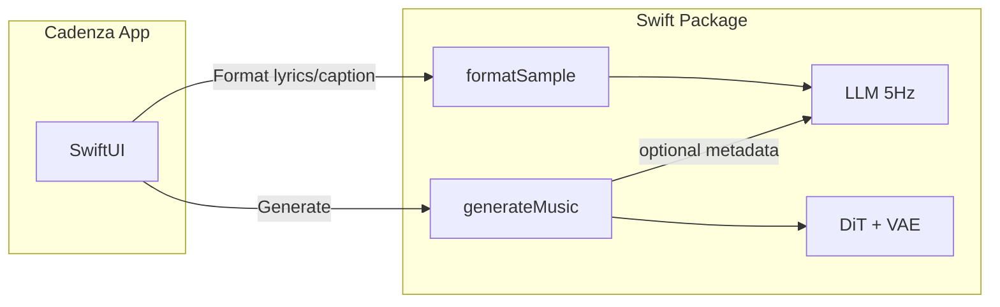

# TDD Plan: Port ACE-Step LLM and Music Generation to Swift (MLX)

## Goal and Cadenza Alignment

Port the **core functionality** required for the [Cadenza Audio macOS app](file:///Users/erich/git/github/erichchampion/cadenza-audio/docs/cadenza-audio-macos-app-plan.md) from Python to a **self-contained Swift package** that uses **MLX Swift** (and **mlx-swift-lm** for the LLM). The app today assumes an embedded Python backend; this port enables a **native Swift backend** so the app can call Swift APIs directly (no embedded interpreter, simpler signing/sandboxing, same UX: song generation first, Settings for models/params).

**In-scope (core):**

- **LLM:** Load 5Hz LM, run **format_sample** (caption/lyrics → enhanced caption + BPM, duration, keyscale, language, time signature) with **constrained decoding** (FSM).
- **Music generation:** **GenerationParams** / **GenerationConfig**, **DiT** conditioning + diffusion loop, **VAE** encode/decode, **generate_music**-style pipeline (text2music: caption + lyrics → audio).

**Out-of-scope for initial port:** Training, Gradio/Streamlit, API server (Cadenza will call the Swift API directly), vLLM/CUDA backends, repaint/cover/lego task types (can be added later), create_random_sample (can be a thin wrapper over format_sample or separate TDD slice).

---

## Reference: Python Code to Port

| Responsibility       | Key Python modules                                                                                                                                             | Swift equivalent (conceptual)                                              |
| -------------------- | -------------------------------------------------------------------------------------------------------------------------------------------------------------- | -------------------------------------------------------------------------- |
| Params & config      | [acestep/inference.py](acestep/inference.py) `GenerationParams`, `GenerationConfig`, `FormatSampleResult`                                                      | `GenerationParams`, `GenerationConfig`, `FormatSampleResult` (value types) |
| Constants            | [acestep/constants.py](acestep/constants.py) (BPM, duration, keyscale, time sig, languages)                                                                    | Shared constants / enums                                                   |
| LLM load & run       | [acestep/llm_inference.py](acestep/llm_inference.py) `LLMHandler` (MLX path: `_load_mlx_model`, `_run_mlx`, `format_sample_from_input`)                        | LLM loader + session + `formatSample(caption:lyrics:...)`                  |
| Constrained decoding | [acestep/constrained_logits_processor.py](acestep/constrained_logits_processor.py) `FSMState`, `MetadataConstrainedLogitsProcessor`                            | FSM + logits masking / sampling guidance in Swift                          |
| format_sample API    | [acestep/inference.py](acestep/inference.py) `format_sample(...)`                                                                                              | `formatSample(...)` returning `FormatSampleResult`                         |
| DiT conditioning     | [acestep/core/generation/handler/conditioning_text.py](acestep/core/generation/handler/conditioning_text.py), conditioning_embed, prepare_condition in handler | Text/lyric encoding + latent prep (MLX)                                    |
| DiT diffusion        | [acestep/models/mlx/dit_generate.py](acestep/models/mlx/dit_generate.py) `get_timestep_schedule`, `mlx_generate_diffusion`, `_mlx_apg_forward`                 | Timestep schedule + diffusion loop + APG in Swift                          |
| DiT model            | [acestep/models/mlx/dit_model.py](acestep/models/mlx/dit_model.py), [dit_convert.py](acestep/models/mlx/dit_convert.py)                                        | DiT model in Swift (MLX) + weight loading                                  |
| VAE                  | [acestep/models/mlx/vae_model.py](acestep/models/mlx/vae_model.py), [vae_convert.py](acestep/models/mlx/vae_convert.py), decode/encode mixins                  | VAE encode/decode in Swift (MLX)                                           |
| Orchestration        | [acestep/core/generation/handler/generate_music.py](acestep/core/generation/handler/generate_music.py), [inference.py](acestep/inference.py) `generate_music`  | High-level `generateMusic(params:config:)` → audio                         |

Existing Python tests to use as **behavioral spec** for TDD (write Swift tests that mirror these, then implement):

- [acestep/core/generation/handler/generate_music_test.py](acestep/core/generation/handler/generate_music_test.py) — orchestration, readiness, error payloads
- [acestep/core/generation/handler/generate_music_request_test.py](acestep/core/generation/handler/generate_music_request_test.py) — runtime/prep
- [acestep/models/mlx/dit_generate.py](acestep/models/mlx/dit_generate.py) (timestep schedule logic is pure; can add Python tests then mirror in Swift)
- [acestep/text2music_src_audio_test.py](acestep/text2music_src_audio_test.py) — `GenerationParams` + text2music src_audio behavior
- Constrained decoding: FSM states and transitions (derive Swift tests from [acestep/constrained_logits_processor.py](acestep/constrained_logits_processor.py) behavior)

---

## TDD Strategy

1. **Tests first:** For each slice, add Swift tests that define the **contract** (inputs → expected outputs or side effects). Where Python already has unit tests, translate the cases into Swift (XCTest).
2. **Pure logic first:** Constants, timestep schedule, FSM state machine, param validation — no model I/O. Fast, deterministic tests.
3. **LLM slice:** Tests for `formatSample` with mocked or small model: given (caption, lyrics) → expect structured metadata (caption, bpm, duration, keyscale, language, timesignature). Then implement loader + constrained decoding + parsing.
4. **DiT/VAE slice:** Tests for timestep schedule; then single diffusion step (shape in/out); then VAE decode (latent → waveform shape). Then full diffusion loop and integration.
5. **Golden / integration (optional):** Run Python once on a fixed prompt/seed, save reference outputs; Swift pipeline tests compare against these (or compare key statistics) to catch regressions.

---

## Swift Package Layout (target structure)

- **Package.swift:** Dependencies: `mlx-swift`, `mlx-swift-lm` (branch or release). Targets below.
- **Sources/AceStepSwift/** (or similar product name):
  - **Types:** `GenerationParams`, `GenerationConfig`, `FormatSampleResult`, constants (BPM, duration, keyscale, time signature, languages).
  - **Constants:** Mirror of `acestep/constants.py` used by LLM and generation.
  - **LLM:** Load 5Hz LM (MLX), tokenizer, constrained decoding (FSM), `formatSample(caption:lyrics:userMetadata:temperature:...)` → `FormatSampleResult`.
  - **DiT:** Config, weight loading, conditioning (text + lyrics → hidden states + context latents), timestep schedule, diffusion step, APG, full `runDiffusion(...)`.
  - **VAE:** Encode (audio → latents), decode (latents → audio); tiled decode if needed.
  - **Pipeline:** `generateMusic(params:config:progress:)` → result (audio buffers + metadata), optionally calling LLM for metadata/codes then DiT then VAE.
- **Tests:** Mirror of the Python test concerns above; plus FSM and timestep tests.

Module size: keep Swift modules under ~200 LOC per file (per [AGENTS.md](AGENTS.md)); split by responsibility (e.g. FSM, sampling, prompt building).

---

## Implementation Phases (TDD in each)

### Phase 1: Package, types, and pure logic (TDD)

- Create Swift package with `MLX` and `mlx-swift-lm` dependencies.
- Add **tests** for: `GenerationParams` / `GenerationConfig` default and validation (e.g. BPM 30–300, duration 10–600), `FormatSampleResult` creation.
- Add **tests** for timestep schedule: given `shift`, `infer_steps` (and optional `timesteps`), expect list of timesteps (match [acestep/models/mlx/dit_generate.py](acestep/models/mlx/dit_generate.py) `get_timestep_schedule`).
- Implement types and timestep schedule in Swift (no model I/O).

### Phase 2: LLM and format_sample (TDD)

- **Tests:** `formatSample` contract: e.g. with a **mock** or minimal model that returns a fixed string, assert parsed `FormatSampleResult` (caption, bpm, duration, keyscale, language, timesignature). Add tests for FSM state transitions (constrained decoding) from valid/invalid token sequences.
- **Tokenizer:** Use mlx-swift-lm tokenizer loading (or HuggingFace-compatible tokenizer) for 5Hz LM; if 5Hz uses a custom tokenizer, document and add a small fixture test.
- **Constrained decoding:** Port FSM from [acestep/constrained_logits_processor.py](acestep/constrained_logits_processor.py) to Swift (states, transitions, logits masking or sampling filter). Integrate with mlx-swift-lm sampling if the API allows logits override; otherwise implement a custom sampling loop that applies FSM.
- **Implement:** Load 5Hz LM (safetensors/config) via mlx-swift-lm or custom MLX loader; run generation with FSM; parse output into `FormatSampleResult`. Expose `formatSample(caption:lyrics:...)` as the main API for Cadenza “Format lyrics/caption”.

### Phase 3: DiT and VAE (TDD)

- **Tests:** Timestep schedule already in Phase 1. Add test: one DiT step (noise + conditions → next latent shape). Add test: VAE decode (latent tensor → waveform shape and basic stats).
- **DiT:** Port [acestep/models/mlx/dit_model.py](acestep/models/mlx/dit_model.py) and conversion/loading to Swift (MLX layers, load weights from checkpoint). Port conditioning (text + lyric encoding, `prepare_condition`-equivalent) and [acestep/models/mlx/dit_generate.py](acestep/models/mlx/dit_generate.py) diffusion loop + APG.
- **VAE:** Port [acestep/models/mlx/vae_model.py](acestep/models/mlx/vae_model.py) and conversion to Swift; implement encode (for reference/source audio if needed) and decode (latents → PCM). Match tiling/overlap behavior if required for memory.
- **Integration test:** Run a minimal “text2music” path: caption + lyrics → conditioning → diffusion → VAE decode → one short audio clip (fixed seed); assert non-empty buffer and optional length.

### Phase 4: Pipeline and Cadenza-ready API

- **Tests:** `generateMusic(params:config:)` with params that skip LLM (e.g. pre-filled metadata, no CoT): expect success and audio. Error cases: missing model, invalid params.
- **Implement:** Orchestration that (1) optionally calls `formatSample` or uses params as-is, (2) prepares conditioning, (3) runs DiT diffusion, (4) decodes with VAE, (5) returns result (audio + metadata). Expose a single entry point suitable for Cadenza (e.g. `AceStepEngine.generateMusic(params:config:)`).
- **Cadenza:** Update [cadenza-audio-macos-app-plan.md](file:///Users/erich/git/github/erichchampion/cadenza-audio/docs/cadenza-audio-macos-app-plan.md) to describe **native Swift backend** option: app depends on this Swift package, calls `formatSample` for “Format” and `generateMusic` for “Generate”; no embedded Python. Keep Section 9 (embedded Python) as alternative if you need to ship before the Swift port is complete.

---

## Risks and Mitigations

| Risk                                                                  | Mitigation                                                                                                                                            |
| --------------------------------------------------------------------- | ----------------------------------------------------------------------------------------------------------------------------------------------------- |
| 5Hz LM checkpoint format / architecture not supported by mlx-swift-lm | Check mlx-swift-lm docs and porting guide; if needed, implement custom loader and architecture in Swift to match Python mlx-lm usage.                 |
| Constrained decoding not supported in mlx-swift-lm API                | Implement custom generate loop in Swift: forward pass → logits → FSM mask → sample next token; repeat until `</think>` or max tokens.                 |
| Tokenizer (HuggingFace) in Swift                                      | Use tokenizer from mlx-swift-lm or same config as Python; if different, add a small compatibility test (tokenize same string, compare IDs or decode). |
| DiT/VAE checkpoint compatibility (PyTorch vs MLX)                     | Python already uses MLX DiT/VAE with converted weights; reuse same conversion or document Swift-side conversion from PyTorch/safetensors.             |
| Large port effort                                                     | Phase 1–2 deliver “Format” (LLM) first so Cadenza can use it; Phase 3–4 deliver “Generate” (music) in a follow-up.                                    |

---

## Diagram: Data flow (Swift package)

---

## Summary

- **Scope:** LLM (`format_sample` + 5Hz LM + constrained decoding) and music generation (GenerationParams/Config, DiT, VAE, `generate_music`-style pipeline) in a **self-contained Swift package** using **MLX Swift** and **mlx-swift-lm**.
- **TDD:** Tests first for types, timestep schedule, FSM, `formatSample` contract, DiT/VAE shapes, and pipeline; implement to pass them; use existing Python tests as spec.
- **Cadenza:** Package can be used by Cadenza Audio as the native backend (format + generate), with the app plan updated to document this option alongside the embedded-Python option.

